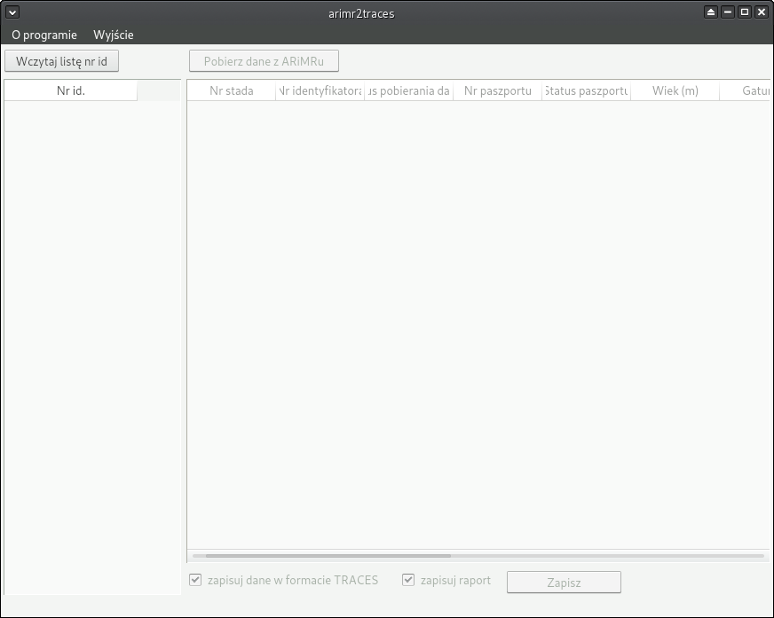

 

# arimr2traces

#### O programie

Pobiera dane o zwierzętach ze strony ARiMRu w celu przygotowania świadectw zdrowia w TRACES.

Lekarze weterynarii pracujący w PIW muszą wpisywać świadectwa zdrowia do systemu TRACES,
pobierając dane o zwierzętach, ręcznie wpisując każdy nr kolczyka do systemu Agencji 
Modernizacji i Restrukturyzacji Rolnictwa, i przekopiowując dane z okienka do okienka.

Ten program to upraszcza. Wystarczy wczytać listę nr identyfikacyjnych zwierząt (zwyczajny plik 
tekstowy gdzie każdy z nr zwierzęcia jest w osobnej linii).
Jeśli dysponuje się loginem i hasłem do systemu ARiMR, program sam pobierze potrzebne
 dane i zapisze je w formacie do wczytania do TRACES, oraz jako arkusz z danymi do wczytania do
 Excela.

#### Instalacja

##### Windows
Jako że pewnie większość korzysta z Windows, załączyłem [instalator](https://github.com/jedrus2000/arimr2traces/releases). (Windows, 64 bit)

Instalator automatycznie instaluje wszystkie komponenty konieczne do uruchomienia programu.

##### Dla zaawansowanych :)
Dla osób obeznanych z Python'em do projektu załączony jest plik requiremnts.txt który zawiera wszystkie komponenty konieczne do zainstalowania przez pip.

#### Informacje techniczne o programie
Program korzysta z Pythona 3.6, biblioteki PyQT5 i lxml.
Instalator został wykonany przy użyciu: [pynsist](https://github.com/takluyver/pynsist)
Plik instalatora wykonalny buduje się komendą: `pynsist installer.cfg`
Można też użyć [PyInstaller](http://www.pyinstaller.org/) do stworzenie pliku uruchamialnego: `pyinstaller --add-data arimr2traces/resources:arimr2traces/resources --distpath ./output --workpath ./build --clean --windowed --onefile run.py --name arimr2traces -i arimr2traces/resources/sheep.ico`

#### Komponenty użyte
Ikonka jest autorstwa [Martina Berube](http://www.softicons.com/animal-icons/animal-icons-by-martin-berube)
